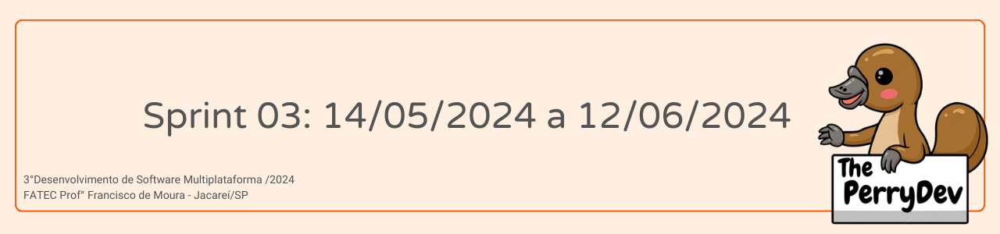
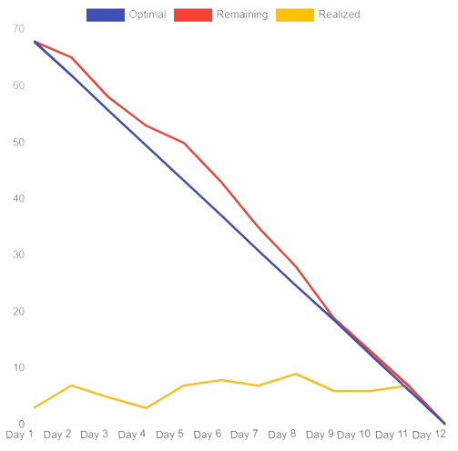

 

 

    <a href="#objetivos">Objetivos da sprint</a> &nbsp |&nbsp &nbsp
    <a href="#entregas">Entregas</a> &nbsp |&nbsp &nbsp
    <a href="#metricas">Métricas do time</a> &nbsp |&nbsp &nbsp

O projeto constituí na construção de uma plataforma web que facilite a administração de projetos de mapeamento e de funcionários para a empresa Visiona Espacial. Com base nessa estruturação a sprint 03 consistiu em horas voltadas para o desenvolvimento front-end do projeto, aprimoramento do backend e criação dos gráficos trocando o uso da ferramenta Power BI por elementos do Material UI.

    
## :dart: Objetivos da Sprint
Os requisitos (funcionais e não funcionais) abrangidos por essa sprint são:
- RF 3: Página de cadastro
- RF 6: Página de funcionários
- RF 7: Página para monitoramento das estatísticas
- RF 13: Aprimoramento backend
- RF 14: Compontes e páginas fazendo uso das ferramentas requisitadas
- RF 15: Armazenamento das informações no SGBD MongoDB
- RF 16: Autenticação do usuário

→ [Voltar ao topo](#topo)

        
## :heavy_check_mark: Entregas

### Modelagem do Banco de Dados

Diversas alterações foram feitas no backend para se adequar de melhor forma ao que foi requisitado pelo cliente e que seja cumprido todos os requisitos do projeto.

→ [Voltar ao topo](#topo)

### Desenvolvimento de diversas páginas do projeto

Pelo fato dessa sprint ter como foco principal o frontend, fizemos algumas correções de cores, tamanhos e fontes das páginas.

→ [Voltar ao topo](#topo)

### Desenvolvimento dos gráficos

Para uma melhor visualização do conteúdo, fizemos uma alteração nos gráficos que antes eram feitos através do Power BI e agora são feitos pelo Material UI.

→ [Voltar ao topo](#topo)

 
     
## :chart_with_upwards_trend: Métricas do time
Em prol de um melhor aproveitamento do tempo disponível durante a terceira sprint o time se dividiu em atividades como: Correção da estilização do site, substituição de páginas do Power BI pelo Material UI, alteração do nome das rotas, inserção de um botão ícone para logout e suas funcionalidades, assim como estruturação da equipe para gestão das horas com o gráfico burndown.
    

    

→ [Voltar ao topo](#topo)

→ [Voltar a página de documentação principal](https://github.com/ThePerryDev/visiona-documentation/tree/main?tab=readme-ov-file)
