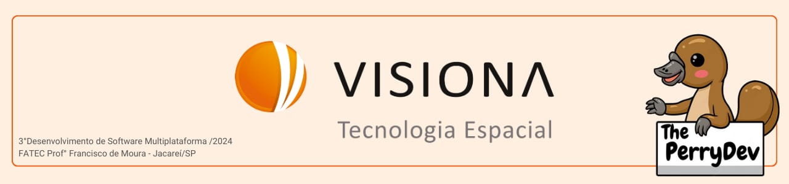
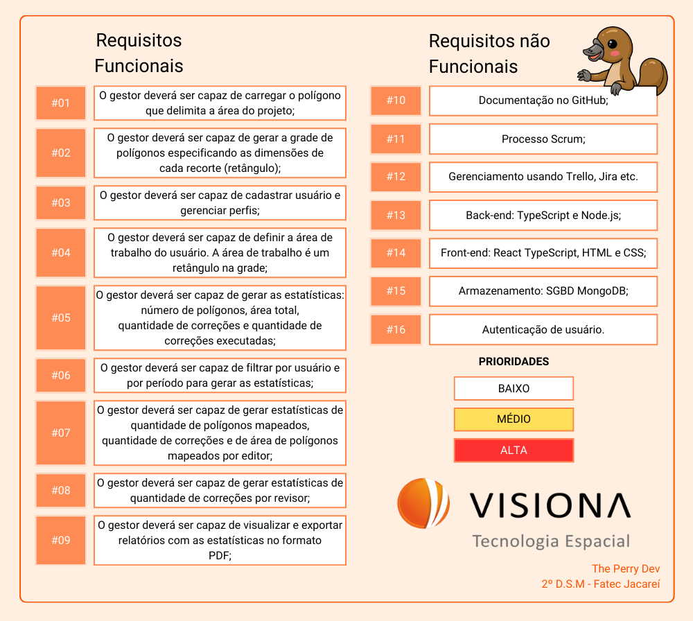

 

 

    <a href="#sobre">Sobre</a>  |  
    <a href="#backlogs">Backlog</a>  |  
    <a href="#user-stories">User Stories</a>  |    
    <a href="#tecnologias">Tecnologias</a>  |  
    <a href="#equipe">Equipe</a>  |  
    <a href="#final">Apresentação Final</a>

   

## :bookmark_tabs: Sobre o projeto

A partir da apresentação do pedido dado pela empresa Visiona, a solução apresentada pela empresa The Perry Devs consiste em criar um plataforma para a administração de projetos de mapemaento realizados pela empresa Visiona.

> _Projeto baseado na metodologia ágil, utilizando o Framework SCRUM, procurando desenvolver a Proatividade, Autonomia, Colaboração e Entrega de Resultados dos envolvidos_

:pushpin: Status do Projeto: **Em Andamento** :on:

### Entregas de Sprints

Cada entrega será realizada a partir da criação de uma **tag** no repositório (Bikepass), assim como a criação de branchs específicas para cada Sprint a fim de controlar cada etapa do projeto. Observe a relação a seguir:
| Sprint | Previsão | Status | Histórico | Link da Apresentação
|:------:|:----------:|:-------------|:-------------------------------------------------:|:-------------------------------------------------:|
| 01 | De 11/03/24 a 03/04/24 | :heavy_check_mark: Finalizado| [Ver relatório](https://github.com/ThePerryDev/visiona-documentation/tree/sprint-01)| [SPRINT 01](https://youtu.be/4JCYQw8IKzM)|
| 02 | De 05/04/24 a 08/05/24 | :heavy_check_mark: Em andamento| Em andamento| Em andamento|
| 03 | De 14/15/24 a 12/06/24 | :heavy_check_mark: Não iniciado| Não iniciado| Não iniciado|

## :dart: Backlog 

 

 

→ [Voltar ao topo](#topo)

## :mag: User Stories

 

→ [Voltar ao topo](#topo)

## :pager: Tecnologias

Para a construção do nosso projeto, utilizamos uma variedade de linguagens, ferramentas, tecnologias e bibliotecas. Cada uma dessas escolhas foi cuidadosamente considerada para garantir a melhor implementação e atender aos requisitos do projeto. Abaixo, apresentamos as utilizadas na construção do projeto.

 

 
 	
 

→ [Voltar ao topo](#topo)

## :busts_in_silhouette: Equipe

|    Função     | Nome                                  |                                                                                                                                                      LinkedIn & GitHub                                                                                                                                                      |
| :-----------: | :------------------------------------ | :-------------------------------------------------------------------------------------------------------------------------------------------------------------------------------------------------------------------------------------------------------------------------------------------------------------------------: |
|   Scrum Master    | Daniel Dornelas                     |            |
|   Product Owner   | Luis Eduardo       |                 |
|   Dev Team    | Bianca Lucas                |       |
|   Dev Team    | Heclair Sousa           |                     |
|   Dev Team    | Willian Garcia               |   |

→ [Voltar ao topo](#topo)
