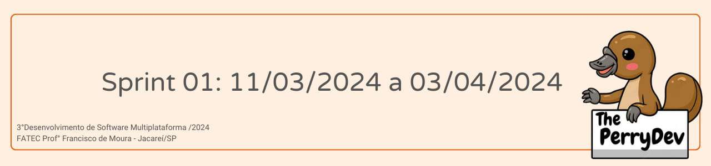
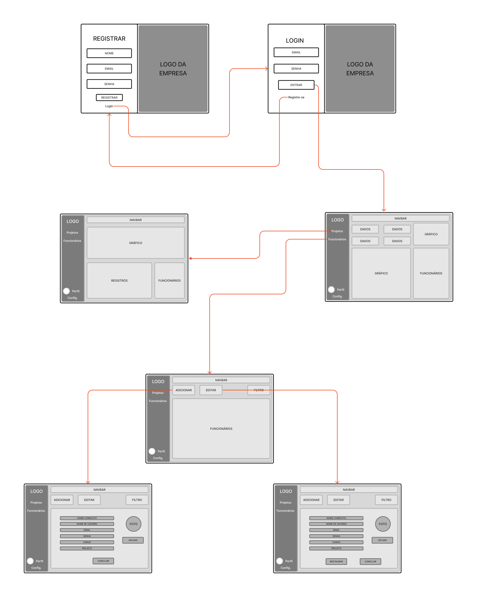
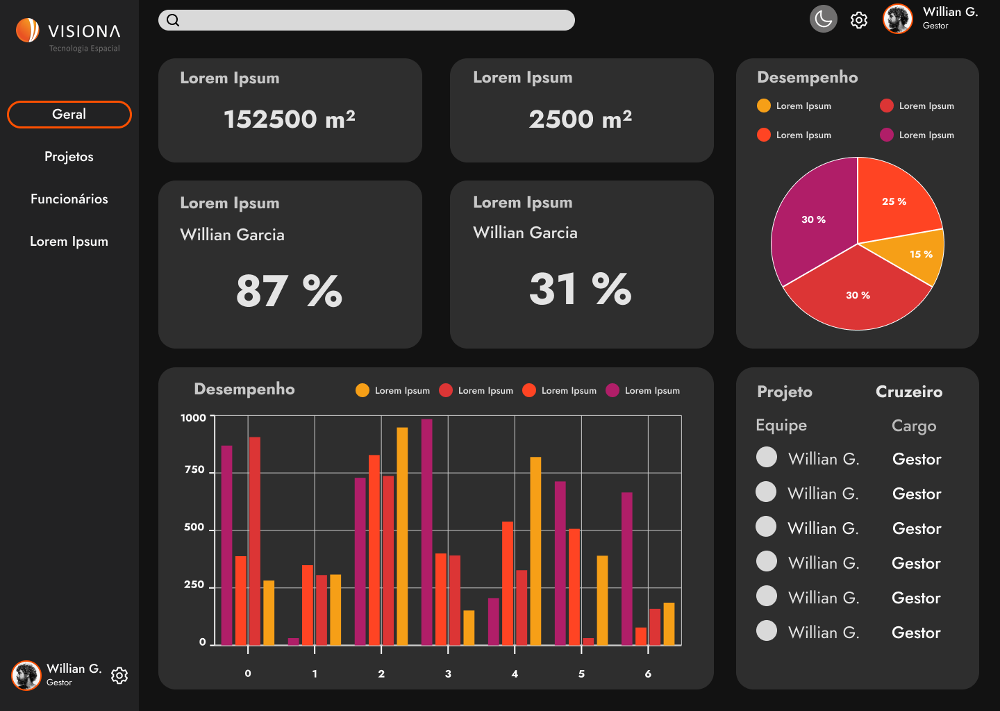
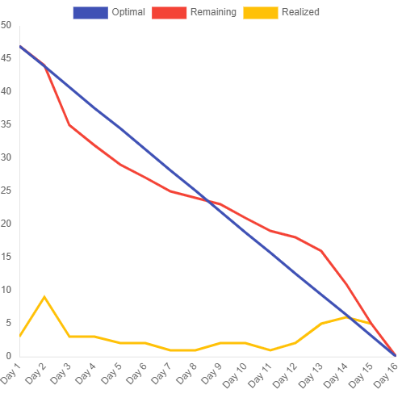

 

 

    <a href="#objetivos">Objetivos da sprint</a> &nbsp |&nbsp &nbsp
    <a href="#entregas">Entregas</a> &nbsp |&nbsp &nbsp
    <a href="#prototipo">Desenvolvimento do Protótipo</a> &nbsp |&nbsp &nbsp 
    <a href="#metricas">Métricas do time</a> &nbsp |&nbsp &nbsp

O projeto constituí na construção de uma plataforma web que facilite a administração de projetos de mapeamento e de funcionários para a empresa Visiona Espacial. Com base nessa estruturação a sprint 01 consistiu em horas voltadas para o levantamento de dados com o cliente, pesquisas bibliográficas, modelagem do banco de dados, desenvolvimento do wireframe e desenvolvimento da base do Front-End.

[LINK DE APRESENTAÇÃO DA SPRINT 01](https://youtu.be/4JCYQw8IKzM)

    
## :dart: Objetivos da Sprint
Os requisitos (funcionais e não funcionais) abrangidos por essa sprint são:
- RF 13: Ligação com o SGBD MongoDB
- RF 14: Desenvolvimento do Wireframe do projeto
- RF 14: Desenvolvimento da Identidade Visual
- RF 14: Criação da Base do Front-End
- RF 15: Tabela de Cadastro dos Usuários
- RF 16: Autenticação do usuário

→ [Voltar ao topo](#topo)

        
## :heavy_check_mark: Entregas

### Levantamento de requisitos

O P.O. manteve a comunicação com o cliente visando entender o desejo e necessidades para o produto em desenvolvimento, construindo em cima deles User Stories e classificando-os em requisitos funcionais e não funcionais (tabelas todas se encontram no tópico [**Backlogs**](#backlogs) do readme principal deste repositório). Além da organização dos requisitos em cada sprint, gerando o Sprint Backlog.

### Modelagem do Banco de Dados

Está sendo estudado o banco de dados fornecido pelo cliente, e além disso foi iniciado o trabalho relacionado ao cadastro e autenticação de novos usuários, sendo essa função autorizada aos gestores do projeto.

→ [Voltar ao topo](#topo)

### Elaboração do wireframe(identidade visual e design do sistema)

Como proposta para solucionar o projeto requisitado de uma plataforma web para melhor gerenciamento de projetos de mapeamento e funcionários para a empresa Visiona, sendo essa administração facilitada através de tabelas para melhor leitura sobre as informações do mesmo, foi desenvolvido o Wireframe a seguir, com a ligação das telas propostas no projeto.

→ [Voltar ao topo](#topo)

    
## :desktop_computer: Desenvolvimento do protótipo
A seguir, iniciou-se o trabalho de desenvolvimento do protótipo na plataforma figma onde era possível permitir ao usuário compreender a interação que o site irá possuir entre as telas e formato com que o mesmo será apresentado. O protótipo a seguir, já foi validado com o cliente.
    

<h2 align="center">Página Principal</h2>

[Confira o protótipo navegável na plataforma FIGMA](https://www.figma.com/proto/QdEmUPrhT49XvnToH1PQrl/Visiona-Espacial-Dashboard?type=design&node-id=1-2&t=YEoMTNcHwZBQqTsB-0&scaling=min-zoom&page-id=0%3A1&starting-point-node-id=1%3A2)

### Criação das Tabelas e Base do Front-End
Com toda a pesquisa inicial desenvolvida, somado ao modelo do banco de dados fornecido pelo cliente e ao wireframe proposto, foram desenvolvidas as tabelas de USERS, com a intenção de gestores registrarem novos usuários no sistema, juntamente com a Base do Front-End, de forma que o cliente possa visualizar, mesmo que de forma bastante simplificada, como o sistema da plataforma da empresa irá funcionar.

Sendo assim, finalizamos os requisitos propostos para esta sprint.

→ [Voltar ao topo](#topo)

 
     
## :chart_with_upwards_trend: Métricas do time
Em prol de um melhor aproveitamento do tempo disponível durante a primeira sprint o time se dividiu em atividades como: planejamento, brieffing, estruturação do GitHub, criação do product backlog, sprint backlog, pesquisa e elaboração do design e da Identidade Visual, criação do wireframe e layout do site, desenvolvimento das tabelas resultantes do modelo do banco de dados, assim como estruturação da equipe para gestão das horas com o gráfico burndown.
    

    

→ [Voltar ao topo](#topo)